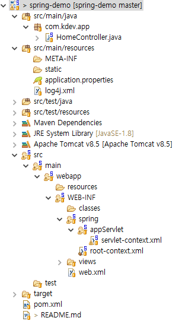

# XML Configuration  

*본 프로젝트는 스프링 프레임워크를 XML 기반으로 설정하는 것을 설명합니다.*  


### 1. 용어 정리
##### 1.1 DD(Deployment Descriptor)  
스프링 애플리케이션에서는 web.xml을 통해서 배포 서술자를 구현합니다. 배포 서술자는 애플리케이션 컨텍스트 및 서블릿, 필터등에 대한 설정을 하도록 되어 있습니다.

##### 1.2 Spring IoC Container  
root-context.xml을 애플리케이션 컨텍스트라고 합니다. 애플리케이션 컨텍스트는 빈 팩토리를 확장한 IoC 컨테이너이기 때문에 빈을 등록 및 관리하고 스프링이 제공하는 각종 부가 서비스를 추가적으로 적용한다.

##### 1.3 Bean
스프링이 IoC로 관리하는 POJO(Plain Old Java Object)입니다. 주의 해야할 부분은 스프링 애플리케이션에서 만드는 모든 오브젝트가 빈인 것은 아닙니다. 

##### 1.4 DI(Dependency Injection)
정확한 용어는 아니지만 DI를 의존성 주입기능이라고 부르겠습니다. 스프링 애플리케이션에서는 IoC로 관리하는 빈을 해당 클래스에서 가져와서 사용할 수 있도록 의존성 주입기능을 제공합니다. 따라서, 의존성 주입기능의 전제조건은 어떠한 방식으든 빈으로 등록되어 있어야 한다는 것입니다.

### 2. 메타정보 설정(Configuration)  



##### 2.1 web.xml  

- ContextLoader  
```
	<context-param>
		<param-name>contextConfigLocation</param-name>
		<param-value>/WEB-INF/spring/root-context.xml</param-value>
	</context-param>

	<listener>
		<listener-class>org.springframework.web.context.ContextLoaderListener</listener-class>
	</listener>
```


