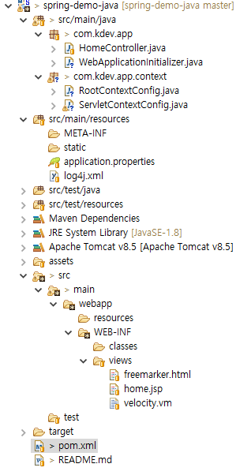

# Java Configuration  

*본 프로젝트는 스프링 프레임워크를 자바 코드 기반으로 설정하는 것을 설명합니다.*  


## 1. 용어 정리  
### 1.1 DD(Deployment Descriptor)  
스프링 애플리케이션에서는 `web.xml`을 통해서 `배포 서술자`를 구현합니다. 배포 서술자는 애플리케이션 컨텍스트 및 서블릿, 필터등에 대한 설정을 하도록 되어 있습니다.

### 1.2 Spring IoC Container  
`root-context.xml`을 애플리케이션 컨텍스트라고 합니다. 애플리케이션 컨텍스트는 `빈 팩토리를 확장한 IoC 컨테이너`이기 때문에 빈을 등록 및 관리하고 스프링이 제공하는 각종 부가 서비스를 추가적으로 적용한다. `자바 코드 기반`의 설정에서는 `@Configuration` 어노테이션을 적용한 클래스들이 대신합니다.

### 1.3 Bean
스프링이 IoC로 관리하는 `POJO(Plain Old Java Object)`입니다. 주의 해야할 부분은 스프링 애플리케이션에서 만드는 모든 오브젝트가 빈인 것은 아닙니다. 

### 1.4 DI(Dependency Injection)
정확한 용어는 아니지만 `DI`를 `의존성 주입기능`이라고 부르겠습니다. 스프링 애플리케이션에서는 IoC로 관리하는 빈을 해당 클래스에서 가져와서 사용할 수 있도록 의존성 주입기능을 제공합니다. 따라서, `의존성 주입기능의 전제조건`은 어떠한 방식으든 빈으로 등록되어 있어야 한다는 것입니다.

## 2. 메타정보 설정(Configuration)  



- *자바 코드 기반의 설정을 위해서는 pom.xml에 아래의 플러그인을 추가해야 됩니다.*  
```xml
            <plugin>
			    <groupId>org.apache.maven.plugins</groupId>
			      <artifactId>maven-war-plugin</artifactId>
			      <configuration>
			         <failOnMissingWebXml>false</failOnMissingWebXml>
			      </configuration>
			</plugin>
```

### 2.1 AbstractAnnotationConfigDispatcherServletInitializer(web.xml)  
기존의 web.xml 배포 서술자는 `AbstractAnnotationConfigDispatcherServletInitializer`를 상속받아 구현하는 클래스로 구현할 수 있습니다. 좀 더 자세하게 살펴보면 `WebApplicationInitializer` 인터페이스의 구현체입니다.

- ContextLoaderListener  
루트 애플리케이션 컨텍스트를 만들어 초기화하고, 애플리케이션과 함께 컨텍스트를 종료시키는 이벤트를 처리하는 `리스너`로써 애플리케이션 컨텍스트를 구성합니다. 따라서, `root-context.xml` 말고도 다수의 애플리케이션 컨텍스트 파일을 구성하여 적용할 수도 있습니다. 만약, 애플리케이션의 규모가 커져서 관리해야할 빈이 많아진다면 이러한 `애플리케이션 컨텍스트를 모듈별로 나누어 관리`하도록 합시다. 
```java
    @Override
    protected Class<?>[] getRootConfigClasses() {
        // TODO Auto-generated method stub
        return new Class<?>[]{RootContextConfig.class};
    }
```

- DispatcherServlet  
스프링 웹 MVC에서 지원하는 `프론트 컨트롤러 서블릿`입니다. 만약, 서블릿 이름을 다르게 지정해주면 애플리케이션에 여러개의 DispatcherServlet을 등록할 수도 있습니다. 각 `DispatcherServlet`은 서블릿이 초기화될 때 루트 애플리케이션 컨텍스트를 찾아서 `자신의 부모 컨텍스트로 사용`합니다. 루트 애플리케이션 컨텍스트 처럼 별도의 모듈로 구성할 수도 있지만, `왠만해서는 그럴일이 없습니다.` 
```java
    @Override
    protected void registerDispatcherServlet(ServletContext servletContext) {
        // TODO Auto-generated method stub
          WebApplicationContext servletAppContext = createServletApplicationContext();
          DispatcherServlet ds = new DispatcherServlet(servletAppContext);
          ServletRegistration.Dynamic appServlet = servletContext.addServlet("appServlet", ds);
          appServlet.setLoadOnStartup(1);
          appServlet.addMapping(getServletMappings());
    }
    
    @Override
    protected String[] getServletMappings() {
        // TODO Auto-generated method stub
        return new String[] { "/" };
    }
    
    @Override
    protected Class<?>[] getServletConfigClasses() {
        // TODO Auto-generated method stub
        return new Class<?>[]{ServletContextConfig.class};
    }
```

- Filter  
서블릿에 적용되는 다양한 `필터`를 적용할 수 있습니다. 만약, 필터가 어떤 역할을 하는지 모르겠다고 하시는 분은 `JSP의 서블릿과 필터`에 대한 부분을 다시 공부하시길 바랍니다.    
```java
    @Override
    protected Filter[] getServletFilters() {
        // TODO Auto-generated method stub
        CharacterEncodingFilter characterEncodingFilter = new CharacterEncodingFilter();
        characterEncodingFilter.setEncoding("UTF-8");
        return new Filter[]{characterEncodingFilter, new HiddenHttpMethodFilter()};
    }
```

### 2.2 RootContextConfig(root-context.xml)  
기존의 `애플리케이션 컨텍스트`는 다음과 같이 설정할 수 있습니다. `@Configuration` 어노테이션을 통해 `메타정보` 클래스인 것을 확인합니다. 

```java
@Configuration
@EnableWebMvc
@ComponentScan(basePackages = { "com.kdev.app" })
public class RootContextConfig {
}
```

- DataSource  
JDBC를 통해서 DB를 사용하려면 `DB Connection 오브젝트`가 필요합니다. 모든 `데이터 액세스에서 사용되는 필수 리소스`이기 때문에 스프링 에서는 DataSource를 하나의 독립된 빈으로 등록되어지도록 합니다. `org.apache.tomcat.jdbc.pool.DataSource`는 `DB Connection Pool` 기능을 적용한 오브젝트로써 `스프링에서 권장하는 DataSource`입니다.
```java
@PropertySource("classpath:application.properties")
public class RootContextConfig {
	@Resource
    private Environment env;

    @Bean
    public DataSource dataSource() {
        DataSource dataSource = new org.apache.tomcat.jdbc.pool.DataSource();
        dataSource.setDriverClassName(env.getProperty("jdbc.driver"));
        dataSource.setUsername(env.getProperty("jdbc.username"));
        dataSource.setUrl(env.getProperty("jdbc.url"));
        dataSource.setPassword(env.getProperty("jdbc.password"));
        dataSource.setConnectionProperties("true");
        dataSource.setTestOnReturn(true);
        dataSource.setTestWhileIdle(true);
        dataSource.setRemoveAbandoned(true);
        dataSource.setRemoveAbandonedTimeout(30);
        dataSource.setLogAbandoned(true);
        dataSource.setValidationQuery("SELECT 1");
        return dataSource;
    }
}
```

- TransactionManager  
`@EnableTransactionManagement` 어노테이션은 `선언적 트랜잭션 기능을 활성화`는 역할을 합니다.  
```java
@EnableTransactionManagement
public class RootContextConfig {
    @Bean
    public PlatformTransactionManager transactionManager(){
        return new DataSourceTransactionManager(dataSource());
    }
}
```

### 2.3 ServletContextConfig(servlet-context.xml)  
서블릿 컨텍스트는 `서블릿과 관련된 메타정보`들을 설정합니다. 구조 상 빈 팩토리 역할도 합니다.

```java
@Configuration
public class ServletContextConfig extends WebMvcConfigurerAdapter{

}
```

- Resources  
```java
	@Override
	public void addResourceHandlers(ResourceHandlerRegistry registry) {
		// TODO Auto-generated method stub
		registry.addResourceHandler("/resources/**").addResourceLocations("/resources/");
	}
```

- ViewResolver  
*As of Spring Framework 4.3, Velocity support has been deprecated due to six years without active maintenance of the Apache Velocity project*  
```java
	@Bean
    public InternalResourceViewResolver jstlViewResolver(){
        InternalResourceViewResolver viewResolver = new InternalResourceViewResolver();
        viewResolver.setOrder(3);
        viewResolver.setViewClass(JstlView.class);
        viewResolver.setPrefix("/WEB-INF/views/");
        viewResolver.setSuffix(".jsp");
        return viewResolver;
    }
```

- MultipartResolver  
```java
	@Bean
	public MultipartResolver multipartResolver(){
		CommonsMultipartResolver cmr = new CommonsMultipartResolver();
		cmr.setMaxUploadSize(env.getProperty("file.maxUploadSize", Long.class));
		return cmr;
	}
```

## 3. 의존성 주입 기능(Dependency Injection)  
그럼 추가적으로 어노테이션을 통해서 `빈으로 등록해서 관리`하도록 하는 방법과 `의존성 주입 기능`을 하도록 지원하는 방법을 알아봅시다.

### 3.1 Bean Annotation  
어노테이션 기반의 빈 등록방법을 이용하기 위해서는 `<annotation-driven/>` 을 통해서 `스프링 어노테이션 지원을 활성화`해야 합니다.
이 `빈 스캐너`는 해당 패키지에 인식된 모든 클래스를 빈으로 등록해주는 역할을 하게 됩니다.  자세히 말하면 `패키지를 탐색`하다가 아래의 `어노테이션이 적용된 클래스`들을 만나면 `빈으로 자동적으로 등록`해주는 셈이 됩니다.

- @Component  
XML에서 Bean태그를 통해서 빈으로 등록했다면 이 어노테이션을 클래스에 적용해서 해당 클래스를 빈으로 등록하는 것을 지원합니다.
```

```

- @Service  
@Component와는 기능적으로 같으나 단순히 이 빈은 서비스 로직에서 사용된다라는 `가독성`을 가집니다.
```

```

- @Repository  
`@Component와 @Service`와는 다르게 `SQLException`에 대해서 `DataAccessException`으로 변환하도록 지원합니다.

```

```

- @Controller  
스프링 웹 MVC에서 지원하는 어노테이션으로 `스프링 웹 서블릿 컨텍스트`에 의해 `웹 요청을 처리하는 컨트롤러 빈`으로 등록됩니다. `@Controller`의 구성을 살펴보게 되면 @Component가 포함되어 있는 것을 확인할 수 있습니다.  

```

```

### 3.2 Dependency Injection Annotation
어노테이션 기반의 빈 등록방법이 있다면 `의존성 주입 기능을 지원하는 어노테이션`도 존재합니다. 이 어노테이션을 통해서 의존성 주입 기능을 사용하기 위해서는 `<context:annotation-config />`라는 `빈 후처리기`를 등록해주어야 합니다. 이와 같은 빈 후처리기는 빈을 등록하는 역할이 아니기 때문에 이미 `등록된 빈이 존재해야합니다.`

- @Autowired  
이 어노테이션은 `타입 기반의 주입`을 먼저 시도하고 이름 기반으로 주입을 시도합니다. 그리고 @Resource와는 다르게 `생성자에도 적용`할 수 있습니다. 다만 주의할 점은 하나의 생성자에만 적용할 수 있다는 점을 알고 있어야 합니다.  
```

```

- @Resource  
이 어노테이션은 `이름 기반의 주입`을 먼저 시도하고 타입 기반으로 주입을 시도합니다.
```

```

- @Inject  
@Autowired가 스프링이 지원하는 전용 에노테이션이라면, @Inject는 JavaEE 6의 표준 스펙에 정의되기 때문에 다른 프레임워크에서 사용할 가능성이 있을 경우 사용하면 됩니다.
```

```

## 4. 관점 지향 프로그래밍(Aspect Oriented Programming)  
`AOP`는 `IoC/DI`와 더불어 `스프링의 대표 기반기술`중의 하나입니다. 스프링의 기술 중에서 가장 이해하기 힘든 난해한 개념을 가진 기술이기 때문에 저도 제대로 설명드리기 힘듬니다. AOP를 적용해서 이용하는 대표적인 대상은 `선언적 트랜잭션`입니다. 바로 `@Transactional`이죠. 그래서 `트랜잭션 매니저`를 서비스 로직에서 주입받지 않고서도 트랜잭션 커밋과 롤백을 지원하도록 할 수 있게 됩니다.

- 토비의 스프링 Vol.1 6장 AOP절을 참고해서 따로 공부합시다.

## 5. 스프링 버전 별 빈 등록 방식  
보통은 스프링 3.0 이상의 버전을 사용하기 때문에 XML기반이냐 자바 코드 기반이냐를 구분하지 않으셔도 됩니다.
- Spring 2.5 : \<bean\>, Bean Scan 
- Spring 3.0 : \<bean\>, Bean Scan, Java Code  
- Spring 4.0 : \<bean\>, Bean Scan, Java Code  

## 6. Database ORM Framework  
스프링 JDBC는 퍼시스턴스 계층에서 활용되는 다양한 데이터 액세스 기술인 `ORM Framework`를 지원합니다.  단순하게 스프링 JDBC를 이용하는 것 보다는 `ORM Framework도 같이 활용하는 것이 좋습니다.`  
- ibatis, Mybatis (DataSourceTransactionManager)
- JPA, Hibernate (JpaTransactionManager)

*이제부터는 여러분들의 영역입니다. 도메인 클래스, 서비스 로직, 비즈니스 로직, 컨트롤러등을 구성해서 서버 API를 구현하고 프론트 엔드를 구현함으로써 웹 애플리케이션을 만들 수 있습니다. 더욱이 스프링 프레임워크에서 제공하는 다양한 프로젝트를 적용함으로써 여러분의 애플리케이션이 한층 더 업그레이드 될 수 있습니다.*

---

## XML Configuration
기존의 XML 기반의 애플리케이션 설정을 확인하기 위해서는 [여기](https://github.com/kdevkr/spring-demo-xml)에서 설명합니다.
